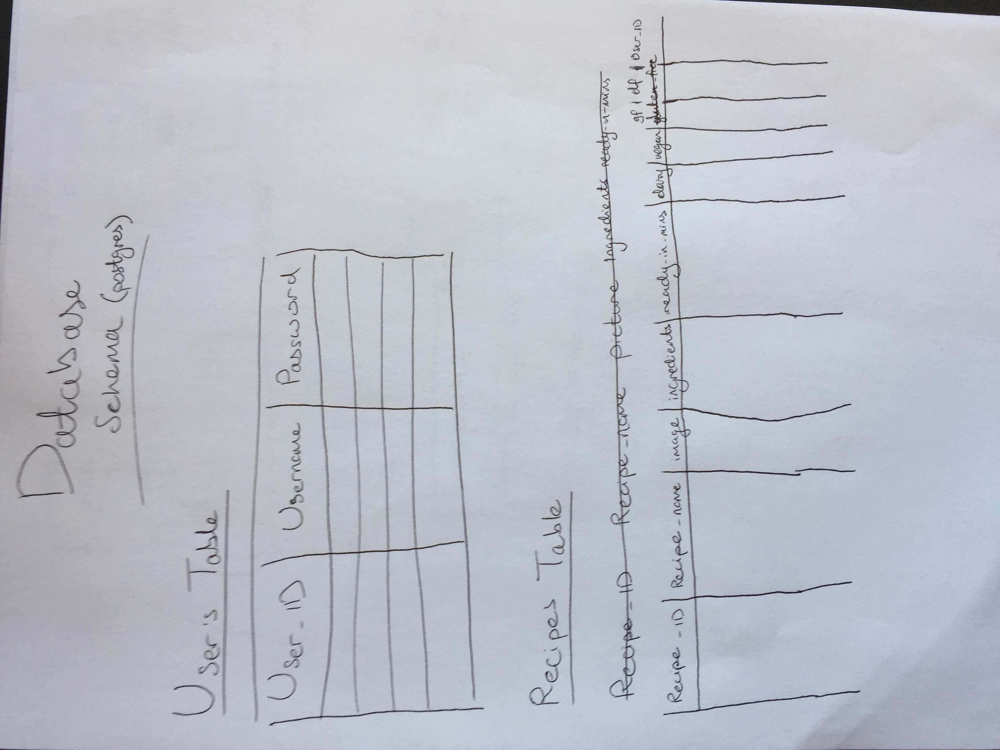

# Foodversity-v2
This final project is carried out by Yusaf and Jade. This project focuses on the development of a HTML and CSS application (served by Flask) that produces a list of recipes based on given ingredients. It was designed to help those who have random ingredients in their homes, don't want to waste food, but don't know what to cook with them. All they need to do is register in Foodversity and type in their ingredients in order to get a list of delicious recipes that contain them.   

## Technologies
- HTML 
- CSS
- Jinja 
- Bootstrap
- SQLite3
- Flask

## Planning
On Friday 7th February 2020, we designed the UI of each page and the database schema.
**UI**

**Schema** 

## User Stories
- As a user I want a username and password to log into the application. 
- As a non-registered user, I want to be able to create an account, so I can later have my personal profile in the application. 
- As a user, I want to be able to search for recipes based on the ingredients of my preference. 
- As a user, I want to have access to previous  recipes, which I have signed within my profile, so I can use them again. 
- As a user, I want to be able to log-out of my account, so somebody else can log-in.

## Daily Standup/Retro

Day 1, Friday: 
Started writing Readme
Connected Flask with a React.js front-end 
Create database, but did not connect it to the project

Day 2, Saturday: 
Split into backend and frontend
Backend: Connect Flask with database 
Frontend: Make components and containers

Day 3, Monday: 
Change database from Postgres to Sqlite3

Day 4, Tuesday:
Make API call
Moved from React to HTML and CSS
Started styling 
Get the data from flask showing inside html files 

Day 5, Wednesday: 
Make logic for Login and Signup
Make recipe page (with recipes being clickable) 
More styling 

Day 6, Thursday:
Saving and displaying “saved” recipes into the user profile
More styling 

Friday:
Test
Presentation slides 

## Challenges & Solutions
| Challenges        | Solutions          
| :------------- |-------------:| 
| Combining React & Flask. | Abandoned the React approach for the plain HTML & CSS one. |
| Communicating with the SQLite database. | Flask-SQLAlchemy documentation |
| Spoonacular API had unexpected loopholes (e.g. some recipes had no instructions).  | Adapted by informing users that instructions weren’t provided by the author. |
| Searching for recipes had to take an appropriate format for the API calls | Regular expression (regex) to split all words by non-letters, and join those words with comma-and-space. |
| Running out of API daily points to make API calls. | Upgraded to a Starter account to gain 150 points per day. |
